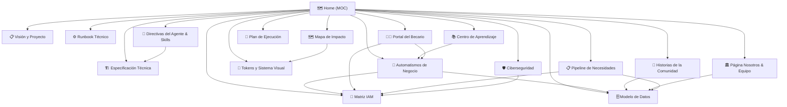

# 🗺️ Forum Foundation — Vault & Map of Content (MOC)

> [!abstract] Resumen Ejecutivo
> Bienvenido a la bóveda de conocimiento del proyecto **Forum Foundation**. Esta plataforma web reemplaza el sitio legacy en WordPress de una ONG educativa en Coclé Norte, Panamá.
> 
> **Premisa Rector**: *"¿Esto permite que el staff publique una actividad en menos de 3 minutos desde un teléfono?"*

---

## 🗂️ Red de Conocimiento (Navegación por Nodos)

---

## 📌 Módulos y Enlaces de la Bóveda

### 1. Visión & Fundamentos
- [[📋 Visión y Documento de Proyecto]]: Los 3 pilares de la fundación, contexto regional en Coclé Norte y filosofía sin lucro ni captación de donaciones.
- [[🏗️ Especificación Técnica (Spec)]]: Arquitectura tecnológica (Next.js 16 + Payload CMS 3 + PostgreSQL), presupuesto de bundle (500 KB) e i18n desde el origen.
- [[🔐 Matriz IAM y Permisos]]: Matriz de los 5 roles, autenticación 2FA opcional, vigencia de sesión (2h vs 30d), flujo de invitaciones y lectura de directiva en 21 colecciones + 2 globales.
- [[🤖 Directivas del Agente & Skills]]: Reglas no-negociables para asistentes de IA, filosofía Ponytail (minimalismo de código), mapeo de habilidades por dominio (`frontend-design`, `backend-development`, etc.) y reglas estéticas (`user_global`).

### 2. Arquitectura & Modelo de Datos
- [[🗄️ Modelo de Datos y Colecciones]]: Estructura detallada de las 21 colecciones de Payload CMS, 2 globales, tipos de datos y relaciones.
- [[🔄 Automatismos de Negocio]]: Flujos de suspensión académica automática, retención/liberación de desembolsos, helper `materiasPendientes`, `prioridad_orden` y los 7 eventos de auditoría activa.
- [[⚙️ Runbook Técnico & Entornos]]: Docker Compose (app + db + Caddy), migraciones SQL con `payload migrate` y CI/CD con GitHub Actions.

### 3. Experiencia Visual & Frontend
- [[🎨 Tokens de Diseño & Tipografía]]: Sistema de diseño canónico (`montana`, `cosecha`, `rio`), reglas tipográficas (Archivo Expanded, Source Serif 4, IBM Plex Mono) y geometría estricta.
- [[📜 Historias de la Comunidad]]: Mural y blog de historias en `/historias`, sembrado de las primeras 5 historias comunitarias (`pnpm seed:historias`).
- [[🏛️ Página Institucional Nosotros]]: Página institucional en `/nosotros`, integrada con el global `Nosotros` (misión e historia) y la colección `Equipo` (integrantes y fundador).
- [[🗺️ Mapa de Impacto & MapLibre]]: Implementación del mapa interactivo (`/impacto`), integración de MapLibre GL JS, trabajadores y paneles laterales.
- [[📚 Centro de Aprendizaje & Quizzes]]: Biblioteca de recursos (descarga offline), tutorías y quizzes interactivos con Server Actions.
- [[👨‍🎓 Portal del Becario & Sesiones]]: Dashboard del estudiante en `/portal`, avance de labor social, historial de desembolsos, banner de suspensión en vivo y reactivaciones.
- [[📋 Pipeline de Necesidades & Directiva]]: Cola pública y formulario con honeypot en `/impacto/necesidades`, y tablero de directiva priorizado en `/directiva/necesidades`.

### 4. Seguridad & Estado de Ejecución
- [[🛡️ Ciberseguridad & No-Negociables]]: Seguridad Zero Trust, protección contra XSS en RichText Lexical, sanitización, reset seguro de contraseñas, auditoría inmutable en 7 eventos y aislamiento de almacenamiento.
- [[🚀 Plan de Ejecución & Estado de Fases]]: Estado en vivo del progreso (Fases 0, 1, 2 y **Fase 3 100% Completada**, junto con la vista `/nosotros` y las 5 primeras Historias).

---

> [!tip] Visualización en Grafo
> Abre la vista de grafo en Obsidian (`Ctrl + G` / `Cmd + G`) para explorar la red interconectada de conceptos del proyecto.
