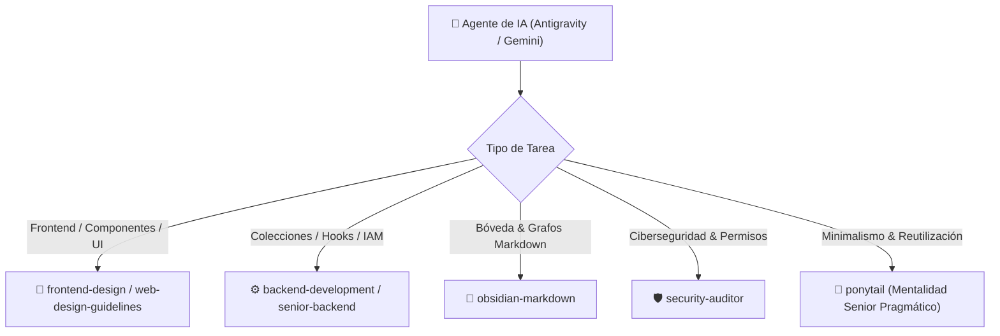

# 🤖 Directivas del Agente, Ponytail & Skills — Forum Foundation

> [!abstract] Instrucciones de Operación para IA Assistants
> Este documento consolida las directivas rectoras, la filosofía de desarrollo **Ponytail** (senior pragmático / perezoso), no-negociables técnicos, normas de diseño y el mapeo de habilidades (skills) que rigen la asistencia de IA en el proyecto Forum Foundation.

---

## 📌 Documentos de Referencia Obligatorios

Antes de ejecutar cualquier tarea en este repositorio, el agente debe inspeccionar:
- [docs/spec.md](docs/spec.md) — Arquitectura, stack, modelo de datos, IAM, ciberseguridad, diseño.
- [docs/plan.md](docs/plan.md) — Estado vivo del progreso por fases.
- [[🗺️ Home - Forum Foundation]] — Bóveda de conocimiento interconectada en Obsidian.

---

## ⚡ Regla Rector del Proyecto

> [!danger] Principio Anti-Abandono
> El sitio anterior en WordPress murió porque publicar era técnicamente engorroso para el staff.  
> 
> **Toda decisión técnica o de interfaz se evalúa contra:**  
> *"¿Esto hace que publicar una actividad tome menos de 3 minutos desde un teléfono móvil por el staff?"*  
> Si una función complica el panel del staff, se recorta o se pliega en "avanzado".

---

## 👴 Filosofía "Ponytail" (Senior Pragmático / Pereza Inteligente)

Adoptamos los principios de **[Ponytail](https://github.com/DietrichGebert/ponytail)** (*"El mejor código es el que nunca tuviste que escribir"*):

> [!quote] La Escala Ponytail
> 1. **¿Necesita existir?** $\rightarrow$ No: omítelo (YAGNI).
> 2. **¿Ya existe en este codebase?** $\rightarrow$ Reutilízalo (ej. `idDeRelacion`, `materiasPendientes`, `registrarAuditoria`).
> 3. **¿La plataforma / stdlib lo resuelve?** $\rightarrow$ Usa funciones nativas (ej. `<input type="date">`, `crypto` nativo).
> 4. **¿Dependencia instalada?** $\rightarrow$ Reutiliza antes de instalar paquetes nuevos.
> 5. **¿Se resuelve en 1 sola línea?** $\rightarrow$ Escribe 1 línea.
> 6. **Solo entonces**: Escribe la cantidad mínima de código limpio que funcione.

*Nota: Pereza para escribir código duplicado o innecesario; rigor absoluto para leer el contexto, mantener la ciberseguridad y proteger la privacidad de los becarios.*

---

## ⛔ No-Negociables Técnicos & de Proceso

1. **Nada hardcodeado**: Comunidades, sedes, programas, materias, becarios, necesidades: siempre colecciones editables por el staff en Payload CMS, nunca fijas en código.
2. **Presupuesto de 500 KB**: En la primera carga del sitio público. Falla el build en CI (`pnpm check:budget`) si se excede.
3. **Localización a nivel de campo (i18n)**: Payload `localization` configurada desde `payload.config.ts` (`es`/`en`).
4. **Privacidad de Becarios**: El estado `suspendido` de un becario NUNCA se expone al público ni de forma agregada (`soloPropioOStaffField`). Es reversible, no una baja. `nota_interna_evaluacion` y `documentacion_socioeconomica` son de lectura restricted a Staff/Admin.
5. **Control de Acceso Explícito**: Declarado en cada colección de Payload. La API expone únicamente lo que `access` permita; se prueba contra `/api/`, no contra la interfaz. La directiva tiene solo lectura (HTTP 200 en lectura, HTTP 403 en escritura en las 20 colecciones + 1 global).
6. **Buckets Separados**: Medios públicos (CDN), documentos de becarios privados (URLs firmadas con expiración), respaldos de BD (sin permiso de borrado WORM).
7. **Documentación Viva**: Mantener `docs/plan.md`, `docs/spec.md` y la bóveda [[🗺️ Home - Forum Foundation|Obsidian]] actualizados en el mismo commit que modifica la funcionalidad.
8. **Edición con Parches Selectivos**: Reemplazar únicamente las líneas afectadas en lugar de regenerar archivos enteros para optimizar consumo de tokens.
9. **Tareas Atómicas (1 a 10 archivos)**: Dividir desarrollos grandes en pasos verificables (`schema + migración` → `backend/hook` → `frontend UI` → `verificación HTTP`).

---

## 🎨 Reglas Visuales (`user_global`)

- **Paleta Canónica**: `montana` (#2c3e35), `cosecha` (#d97706), `rio` (#0284c7), `tinta` (#1c1917), `piedra` (#78716c), `niebla` (#f5f5f4).
- **Tipografía Semántica**:
  - Titulares: *Archivo Expanded* (mayúsculas, ancha).
  - Cuerpo de texto: *Source Serif 4* (serifa editorial).
  - Datos Verificables: *IBM Plex Mono* (exclusivo para fechas, coordenadas lat/lng, montos numéricos y métricas de impacto).
- **Geometría**: `border-radius: 4px` en botones/tarjetas, `2px` en badges, `0px` en imágenes. **Cero sombras** (`box-shadow`). Bordes hairline (`1px border-piedra/25`).

---

## 🛠️ Mapeo de Skills por Dominio

---

## 🔗 Nodos Relacionados
- [[🗺️ Home - Forum Foundation]]
- [[📋 Visión y Documento de Proyecto]]
- [[🏗️ Especificación Técnica (Spec)]]
- [[🔐 Matriz IAM y Permisos]]
- [[⚙️ Runbook Técnico & Entornos]]
