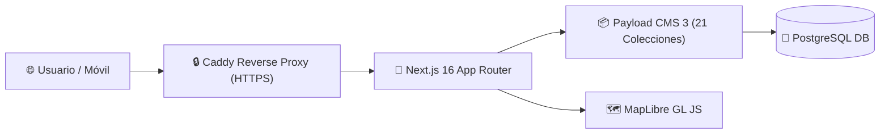

# 🏗️ Especificación Técnica (Spec) — Forum Foundation

> [!important] Stack Consolidado
> - **Framework**: Next.js 16 (App Router)
> - **CMS**: Payload CMS 3.82.1 (21 colecciones, 2 globales)
> - **Base de Datos**: PostgreSQL (`@payloadcms/db-postgres`)
> - **Estilos**: Tailwind CSS v4 + Vanilla CSS con tokens del [[🎨 Tokens de Diseño & Tipografía|Sistema Visual]].
> - **Mapas**: MapLibre GL JS para el [[🗺️ Mapa de Impacto & MapLibre|Mapa de Impacto]].

---

## 📐 Decisiones de Arquitectura

### 1. Rendimiento y Presupuesto de Bundle
- **Límite máximo**: **500 KB** en la primera carga del sitio público.
- **CI Enforcement**: El script `scripts/check-bundle-budget.mjs` analiza la salida del build y falla el pipeline si excede el presupuesto (actualmente en 162.2 KB).

### 2. Localización Multilingüe desde el Origen (i18n)
- **Configuración de Payload**: `locales: ['es', 'en']`, con `defaultLocale: 'es'`.
- Configurada a nivel de campo en [[🗄️ Modelo de Datos y Colecciones|Payload CMS]] desde el día uno para evitar migraciones complejas del esquema en el futuro.
- Enrutamiento público con Next.js App Router mediante el parámetro `[locale]` (ej. `/nosotros`, `/aprende`, `/impacto`).

### 3. Server-Side Rendering (SSR) & Dynamic Pages
- Las páginas de contenido en `(frontend)/[locale]` exportan `export const dynamic = 'force-dynamic'`.
- Esto garantiza que Next.js renderice dinámicamente por request sin requerir la base de datos alcanzable durante el `docker build` en aislamiento.

---

## 🔗 Nodos Relacionados
- [[🗺️ Home - Forum Foundation]]
- [[📋 Visión y Documento de Proyecto]]
- [[🗄️ Modelo de Datos y Colecciones]]
- [[🏛️ Página Institucional Nosotros]]
- [[⚙️ Runbook Técnico & Entornos]]
- [[🛡️ Ciberseguridad & No-Negociables]]
