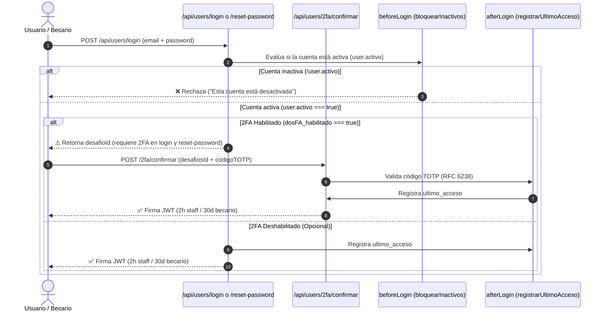

# 🔐 Matriz IAM y Permisos — Forum Foundation

> [!shield] Principio de Menor Privilegio
> El control de acceso está explícitamente declarado en cada colección de [[🗄️ Modelo de Datos y Colecciones|Payload CMS]]. La API expone únicamente lo que la función `access` permita. Nunca se confía en la interfaz cliente.

---

## 👥 Matriz de Roles, Permisos & Duración de Sesión

| Rol | Descripción | Alcance de Permisos | Creación de Cuentas | Duración de JWT / Sesión |
| :--- | :--- | :--- | :--- | :--- |
| `admin` | Administrador del sistema | Acceso total (CRUD en las 22 colecciones + 2 globales). | Puede crear cualquier rol (`admin`, `staff`, `directiva`, `becario`). | **2 horas** (corta vigencia) |
| `staff` | Personal operativo de la ONG | Edición de contenidos, actividades, tutorías, equipo, verificación y necesidades. | Puede invitar becarios y directiva (`create: esStaffOSuperior`). No escala a admin. | **2 horas** (corta vigencia) |
| `directiva` | Junta directiva / Fundadores | **Lectura total de solo lectura en las 22 colecciones + 2 globales**. Cero permisos de escritura (403 verificado). | Sin permisos de creación. | **2 horas** (corta vigencia) |
| `becario` | Estudiantes beneficiarios | Acceso a sus propios datos, fotos, desembolsos y labor social. | Sin permisos de creación. | **30 días** (sesión larga para móviles) |
| `público` | Visitantes del sitio web | Lectura de contenidos públicos marcados explícitamente (`visible_publicamente`, `/nosotros`, etc.). | Sin acceso de administración ni login. | Sin sesión |

> [!note] Verificación de la Vista de Directiva
> Se ha verificado vía API real que el rol `directiva` tiene permisos de lectura HTTP 200 en las **21 colecciones** (de las 22) + 2 globales cerradas en Fase 3, mientras que cualquier intento de escritura (POST/PATCH/DELETE) es bloqueado con HTTP 403 Forbidden sin excepciones.
>
> **Única excepción a "directiva lee todo":** `DocumentosPrivados` (agregada después de esta verificación, en la remediación de seguridad de 2026-08-01/03) es `read: esStaffOSuperior` — ni directiva la lee. Decisión deliberada: ninguna vista de directiva renderiza estos archivos, y uno de los cuatro campos que guarda (`Recuperaciones.evidencia`) delataría por sí solo que un becario estuvo suspendido.

---

## 🔑 Flujo de Autenticación & Desafío 2FA

---

## 🔒 Control por Campo (Field-Level Access)

- `esAdminFieldAccess`: Exclusivo de administradores para alterar roles o desactivar cuentas.
- `esStaffOSuperiorFieldAccess`: Oculta `nota_interna_evaluacion`, `documentacion_socioeconomica` y expone `enlace_invitacion`.
- `esStaffDirectivaOAdminFieldAccess`: Oculta el campo `solicitante` en [[🗄️ Modelo de Datos y Colecciones|Necesidades]] para peticiones públicas o de becarios, protegiendo la identidad de quien reporta una carencia comunitaria.
- `dosFA_secreto`: `{ create: () => false, read: () => false, update: () => false }` (Totalmente invisible por API).

---

## 🔗 Nodos Relacionados
- [[🗺️ Home - Forum Foundation]]
- [[🗄️ Modelo de Datos y Colecciones]]
- [[🏛️ Página Institucional Nosotros]]
- [[📋 Pipeline de Necesidades & Directiva]]
- [[🔄 Automatismos de Negocio]]
- [[🛡️ Ciberseguridad & No-Negociables]]
- [[🚀 Plan de Ejecución & Estado de Fases]]
