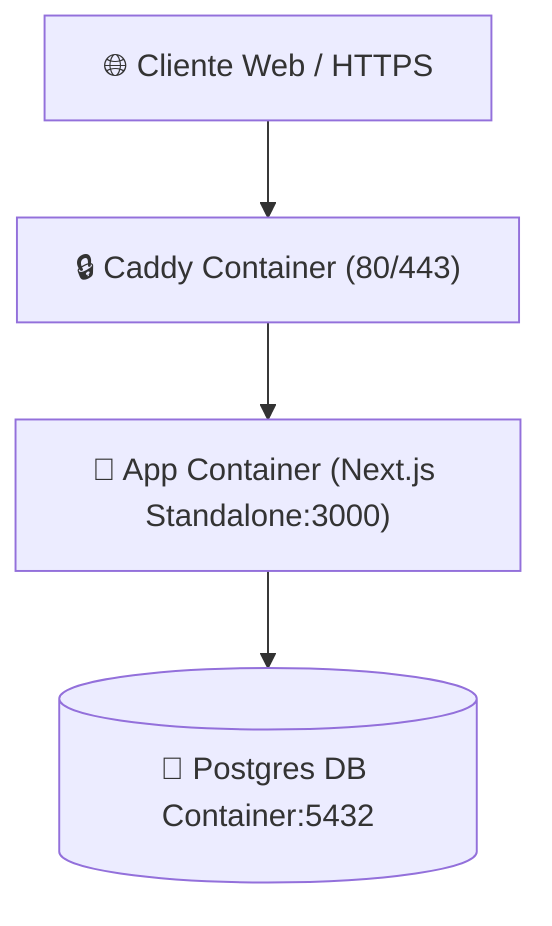

# ⚙️ Runbook Técnico & Entornos — Forum Foundation

> [!gear] Operaciones & Comandos Rápidos
> Guía completa para desarrollo local, migraciones de base de datos, compilación en Docker y despliegue en staging/producción.

---

## 🛠️ Comandos Principales (`package.json`)

```bash
# Desarrollo local (con Next.js Webpack para evitar panics de Turbopack con SCSS admin)
pnpm dev

# Typecheck estricto de TypeScript
pnpm typecheck

# Linter con ESLint 9
pnpm lint

# Validación de presupuesto de bundle (falla si excede 500 KB)
pnpm check:budget

# Crear una migración nueva a partir de los cambios en colecciones
pnpm payload migrate:create nombre_de_migracion

# Sembrado idempotente de datos iniciales en local
pnpm seed
```

---

## 🐳 Entorno Docker Staging (`docker-compose.staging.yml`)

El entorno contiene tres contenedores aislados:

1. **`app`**: Contenedor multietapa (`Dockerfile`) ejecutando Next.js 16 standalone en puerto 3000 interno (no expuesto a la red pública).
2. **`db`**: PostgreSQL 16 con volumen persistente `postgres_data`.
3. **`caddy`**: Proxy inverso Caddy con HTTPS automático, TLS, cabeceras de seguridad HSTS e intercepción en puerto 80/443.



---

## 🗄️ Gestión de Migraciones en Producción

```bash
# Aplicar migraciones pendientes dentro del contenedor app
docker compose -f docker-compose.staging.yml exec app pnpm payload migrate
```

> [!important] Regla de Migraciones
> Dev usa `push` automático para prototipar. Todo cambio de esquema que vaya a producción **debe generar su migración en `src/migrations/`** antes de commitear.

---

## 🔗 Nodos Relacionados
- [[🗺️ Home - Forum Foundation]]
- [[🏗️ Especificación Técnica (Spec)]]
- [[🗄️ Modelo de Datos y Colecciones]]
- [[🛡️ Ciberseguridad & No-Negociables]]
