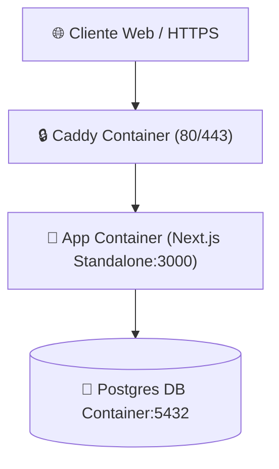

# ⚙️ Runbook Técnico & Entornos — Forum Foundation

> [!gear] Operaciones & Comandos Rápidos
> Guía completa para desarrollo local, migraciones de base de datos, compilación en Docker y despliegue en staging/producción.

---

## 🛠️ Comandos Principales (`package.json`)

```bash
# Desarrollo local (con Next.js Webpack para evitar panics de Turbopack con SCSS admin)
pnpm dev

# Typecheck estricto de TypeScript
pnpm typecheck

# Linter con ESLint 9
pnpm lint

# Validación de presupuesto de bundle (falla si excede 500 KB)
pnpm check:budget

# Crear una migración nueva a partir de los cambios en colecciones
pnpm payload migrate:create nombre_de_migracion

# Sembrado idempotente de datos iniciales en local
pnpm seed
```

---

## 🐳 Entorno Docker Staging (`docker-compose.staging.yml`)

El entorno contiene tres contenedores aislados:

1. **`app`**: Contenedor multietapa (`Dockerfile`) ejecutando Next.js 16 standalone en puerto 3000 interno (no expuesto a la red pública).
2. **`db`**: PostgreSQL 16 con volumen persistente `postgres_data`.
3. **`caddy`**: Proxy inverso Caddy con HTTPS automático, TLS, cabeceras de seguridad HSTS e intercepción en puerto 80/443.



---

## 🗄️ Gestión de Migraciones en Producción

> [!bug] Corregido 2026-08-04 — el comando de abajo NO funciona
> `docker compose exec app pnpm payload migrate` falla contra la imagen real: el contenedor `runner` (salida `standalone`) no incluye el CLI de Payload a propósito, para mantener la imagen final mínima. Las migraciones se corren desde una imagen aparte construida del stage intermedio `build` — automatizado en `scripts/deploy.sh --migrate`. Detalle completo en [docs/runbook-despliegue.md](file:///home/fabianc/Documentos/ForumPage/docs/runbook-despliegue.md).

```bash
# NO usar en producción — falla, ver nota arriba. Documentado acá solo para
# que quede constancia de qué NO hacer.
docker compose -f docker-compose.staging.yml exec app pnpm payload migrate
```

> [!important] Regla de Migraciones
> Dev usa `push` automático para prototipar. Todo cambio de esquema que vaya a producción **debe generar su migración en `src/migrations/`** antes de commitear.

---

## 🔐 Endurecimiento del VPS (2026-08-04)

> [!shield] `ufw` + `fail2ban` + rate limiting real en Caddy
> `ufw` activo (solo 22 con `limit`/80/443), `fail2ban` en `sshd` (ya baneó IPs de escaneo real), y `Dockerfile.caddy` (Caddy + plugin `caddy-ratelimit`, la imagen oficial no lo trae) limitando `/api/users/*` a 30 pedidos/min por IP — verificado con una ráfaga real dando `429` en la request 31. `unattended-upgrades` y el endurecimiento de SSH ya venían así por defecto en la AMI de Ubuntu de AWS. Detalle en [[🚀 Plan de Ejecución & Estado de Fases]], Fase 1, Paso S.

---

## 🚀 Primer despliegue real (2026-08-04)

> [!rocket] VPS de AWS, no el droplet definitivo
> El sitio ya corre en un servidor real: `https://volumetrix.servegame.com` (AWS EC2, Ubuntu 26.04) — un VPS que el usuario ya tenía, usado mientras se define presupuesto para el droplet de DigitalOcean de `01-documento-de-proyecto.md` §12. `scripts/deploy.sh` no depende de cuál sea el servidor (parametrizado por `DEPLOY_HOST`/`DEPLOY_USER`/`DEPLOY_KEY`), así que el proceso no cambia cuando eso ocurra. Detalle completo en [[🚀 Plan de Ejecución & Estado de Fases]], Fase 1, Paso Q, y en [docs/runbook-despliegue.md](file:///home/fabianc/Documentos/ForumPage/docs/runbook-despliegue.md).

---

## 🔗 Nodos Relacionados
- [[🗺️ Home - Forum Foundation]]
- [[🏗️ Especificación Técnica (Spec)]]
- [[🗄️ Modelo de Datos y Colecciones]]
- [[🛡️ Ciberseguridad & No-Negociables]]
