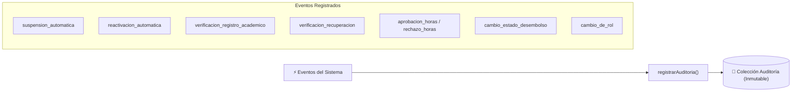
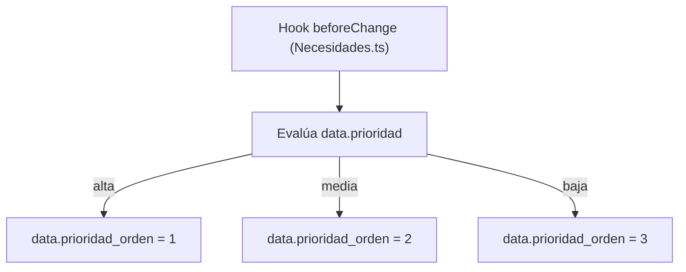

# 🔄 Automatismos de Negocio — Forum Foundation

> [!important] Reglas de Negocio en Cascada & Auditoría
> Los automatismos centrales del sistema operan directamente en los hooks de [[🗄️ Modelo de Datos y Colecciones|Payload CMS]], garantizando la sincronización de estados, trazabilidad inmutable y ordenamiento automático.

---

## 1. Auditoría Activa Ampliada (`registrarAuditoria`)

Toda acción de impacto en el sistema queda registrada inmutablemente en la colección `Auditoria` mediante el helper compartido `registrarAuditoria` ([src/lib/auditoria.ts](file:///home/fabianc/Documentos/ForumPage/src/lib/auditoria.ts)).

---

## 2. Automatismo de Suspensión y Reactivación de Becarios

- **Suspensión**: Verificar un `RegistroAcademico` con materias reprobadas suspende al becario y pasa desembolsos `programados` a `retenidos`.
- **Reactivación**: El helper `materiasPendientes` ([src/lib/materias-pendientes.ts](file:///home/fabianc/Documentos/ForumPage/src/lib/materias-pendientes.ts)) calcula las reprobadas menos las recuperadas verificadas. Al llegar a 0, el becario pasa a `activo`, liberando pagos y completando `fecha_reactivacion`.

---

## 3. Sincronización de Prioridad en Necesidades (`prioridad_orden`)

El campo `prioridad` en `Necesidades` es texto (`alta`, `media`, `baja`). Ordenar alfabéticamente en SQL colocaría `baja` en segundo lugar.

> [!tip] Ordenamiento Numérico Garantizado
> La cola priorizada de la directiva ([/directiva/necesidades](file:///home/fabianc/Documentos/ForumPage/src/app/%28frontend%29/%5Blocale%5D/directiva/necesidades/page.tsx)) ordena por `prioridad_orden: 'asc'`, garantizando que las carestías de prioridad `alta` aparezcan siempre en primer lugar.

---

## 🔗 Nodos Relacionados
- [[🗺️ Home - Forum Foundation]]
- [[🔐 Matriz IAM y Permisos]]
- [[🗄️ Modelo de Datos y Colecciones]]
- [[📋 Pipeline de Necesidades & Directiva]]
- [[⚙️ Runbook Técnico & Entornos]]
