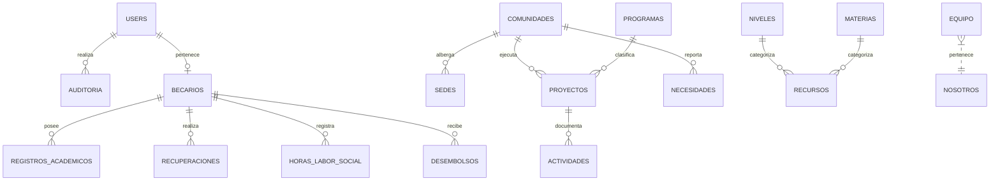

# 🗄️ Modelo de Datos y Colecciones — Forum Foundation

> [!database] Estructura General
> El sistema se compone de **22 colecciones** y **2 globales** en [[🏗️ Especificación Técnica (Spec)|Payload CMS 3]], mapeadas a tablas PostgreSQL vía `@payloadcms/db-postgres`.

---

## 🗺️ Mapa de Colecciones por Módulo

---

## 📑 Catálogo de Colecciones

### 1. Sistema & IAM
- `Users`: Autenticación, roles (`admin`, `staff`, `directiva`, `becario`), `activo`, `ultimo_acceso`, `dosFA_habilitado`, `enlace_invitacion` y vigencia de JWT por rol.
- `Media`: Imágenes **públicas** del sitio (`read: () => true`). Validación cruzada de menores de edad y consentimiento. Nunca documentos de expediente — eso es `DocumentosPrivados`.
- `DocumentosPrivados` (Colección 22): Solo-staff en las cuatro operaciones (ni directiva lee). Guarda lo que nunca puede filtrarse: `Becarios.documentacion_socioeconomica`, `RegistrosAcademicos.documento`, `HorasLaborSocial.evidencia` y `Recuperaciones.evidencia` (delata suspensión — por eso ni siquiera directiva tiene acceso). Migración a Postgres de dev confirmada (17/17 aplicadas); solo falta correr contra producción cuando exista droplet.
- `FotosBecarios` (2026-08-04): antes `Becarios.foto` apuntaba a `Media` (público siempre). Ahora su propia colección con un campo `publica` que un hook `afterChange` en `Becarios` sincroniza con `mostrar_en_mapa` en cada save — pública solo mientras el consentimiento sigue vigente, staff/directiva/admin la ven siempre. Resuelve el hueco de privacidad sin esperar a buckets S3: el mismo control de acceso declarativo de Payload (`access.read` con una condición) alcanza para un caso condicional.
- `DestinosInternacionales` (2026-08-04): los 6 destinos frecuentes de becarios internacionales (Bocconi, University of Florida, Navarra, Tec de Monterrey, EARTH, Zamorano) vivían hardcodeados en dos formularios de `/staff`. Ahora colección editable por staff, lectura pública.
- `Auditoria`: Registro inmutable de 7 eventos automáticos y manuales de negocio (escritura bloqueada desde panel).
- `Configuracion` (Global 1): Parámetros globales, `texto_aviso_suspension` y fecha de actualización de cifras de impacto.
- `Nosotros` (Global 2): Contenido institucional de la página `/nosotros` (misión, historia en Lexical RichText localizado, foto y logo).

### 2. Contenido & Territorio (Fase 1)
- `Comunidades`: Coordenadas lat/lng, distrito, descripción y proyectos activos.
- `Sedes`: Sitios físicos de la fundación, coordenadas, horarios y comunidad asociada.
- `CentrosEducativos`: Escuelas y colegios de la zona.
- `Programas`: Categorías de inversión (Infraestructura, Becas, etc.).
- `Proyectos`: Obras comunitarias con porcentaje de avance, fotos antes/después y montos.
- `Actividades`: Historias y publicaciones del blog unificadas con galería y comunidad/proyecto asociado.
- `Equipo` (Colección 21): Integrantes del equipo institucional mostrados en `/nosotros` (nombre, cargo, bio, foto, `destacado` para tarjeta grande del fundador y `orden`).

### 3. Centro de Aprendizaje (Fase 2)
- `Niveles`: Clasificación educativa (Primaria, Secundaria, Universidad).
- `Materias`: Asignaturas (Matemáticas, Inglés, etc.).
- `Recursos`: Materiales educativos en la biblioteca (PDFs propios, enlaces, videos de YouTube).
- `Practicas`: Quizzes autocorregibles de opción múltiple.
- `Tutorias`: Sesiones presenciales o virtuales anunciadas con sede, horario y cupos. Desde 2026-08-10, también `realizada` (checkbox) + `participantes` (número, condicionado a `realizada`) para registrar asistencia real, no solo el anuncio.

### 4. Portal del Becario & Cierre (Fase 3 - Bloques 5 y 6)
- `Becarios`: Expediente del estudiante, universidad, tipo de estudio, `estado`, `fecha_suspension`, `fecha_reactivacion` y campos de privacidad socioeconómica.
- `RegistrosAcademicos`: Notas del período, materias aprobadas/reprobadas, índice y `nota_interna_evaluacion`.
- `Recuperaciones`: Registro de materias recuperadas con estado de verificación.
- `HorasLaborSocial`: Horas comunitarias reportadas por el becario con estado de aprobación.
- `Desembolsos`: Calendario de pagos (`programado`, `retenido`, `pagado`, `cancelado`). Borrado bloqueado.
- `Necesidades`: Carestías comunitarias reportadas (`evaluacion`, `aprobada`, `en_ejecucion`, `completada`), con prioridad (`alta`, `media`, `baja`), `prioridad_orden` (campo numérico ordenado), `costo_estimado`, `visible_publicamente` y campo sensible `solicitante` (protegido con `FieldAccess`).

---

## 🔗 Nodos Relacionados
- [[🗺️ Home - Forum Foundation]]
- [[🔐 Matriz IAM y Permisos]]
- [[🏛️ Página Institucional Nosotros]]
- [[📋 Pipeline de Necesidades & Directiva]]
- [[🔄 Automatismos de Negocio]]
- [[📚 Centro de Aprendizaje & Quizzes]]
