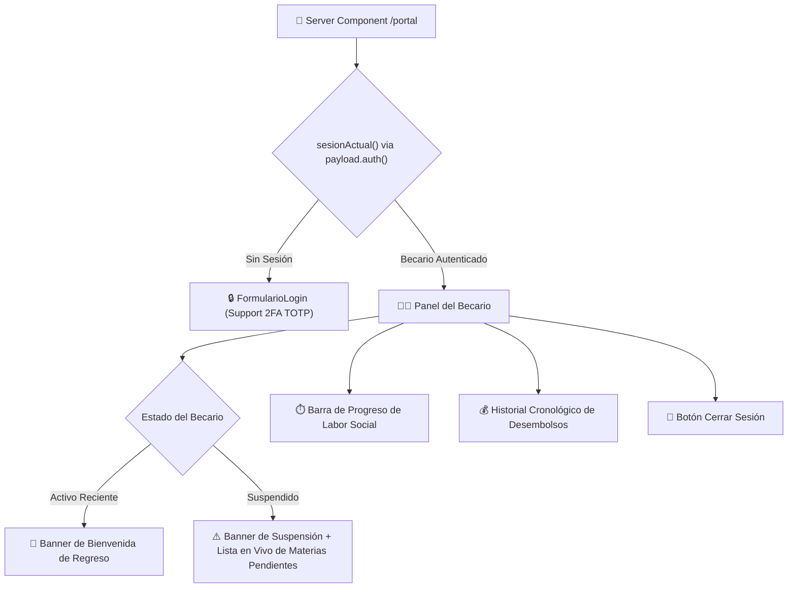

# 👨‍🎓 Portal del Becario & Sesiones — Forum Foundation

> [!graduated-cap] Interfaz del Beneficiario (`/portal`)
> El Portal del Becario es la aplicación donde los estudiantes consultan el estado de su beca, su progreso en labor social, el historial de desembolsos y la lista en vivo de materias pendientes en caso de suspensión.

> [!book] Manual del becario (2026-08-04)
> Guía paso a paso en texto plano, sin capturas: [docs/manual-becario.md](file:///home/fabianc/Documentos/ForumPage/docs/manual-becario.md). Aclara explícitamente que el becario **no** sube su propio expediente académico — esa carga la hace el staff en su nombre.

---

## 🏗️ Arquitectura de Autenticación & Componentes

---

## 🧩 Componentes y Funcionalidades Del Portal

### 1. Inicio de Sesión & Formularios ([FormularioLogin.tsx](file:///home/fabianc/Documentos/ForumPage/src/components/FormularioLogin.tsx))
- Soporta inicio de sesión por email/password y maneja automáticamente la bifurcación del desafío 2FA TOTP (`confirmarDosFA`).
- **Restablecimiento y Activación**: Formulario unificado ([FormularioContrasena.tsx](file:///home/fabianc/Documentos/ForumPage/src/components/FormularioContrasena.tsx)) para activar cuentas invitadas o restablecer contraseñas con desafío 2FA integrado.
- **"Seguridad de mi cuenta" (2026-08-04)**: página nueva `/[locale]/cuenta/seguridad`, enlazada desde el header de `/portal` y `/staff`. Un solo set de componentes sirve para cualquier rol, porque los endpoints/acciones no distinguen rol, solo `req.user`/sesión.
  - **2FA** ([FormularioDosFA.tsx](file:///home/fabianc/Documentos/ForumPage/src/components/FormularioDosFA.tsx)): antes de esto el backend del Paso H estaba probado pero sin ninguna UI — activar/desactivar 2FA solo era posible llamando a los endpoints a mano.
  - **Cambiar contraseña** ([FormularioCambiarPassword.tsx](file:///home/fabianc/Documentos/ForumPage/src/components/FormularioCambiarPassword.tsx) / `src/actions/cambiar-password.ts`): exige la contraseña actual antes de cambiarla.
  - **Sesiones activas** ([PanelSesiones.tsx](file:///home/fabianc/Documentos/ForumPage/src/components/PanelSesiones.tsx) / `src/actions/cerrar-todas-sesiones.ts`): muestra `ultimo_acceso` y cantidad de sesiones, con botón para cerrarlas todas (incluida la propia, a propósito — más simple y más seguro que preservar solo "esta sesión").

### 2. Progreso de Labor Social
- Calcula las horas aprobadas en [[🗄️ Modelo de Datos y Colecciones|HorasLaborSocial]] contra la meta anual del becario.
- Muestra porcentaje de avance y barra visual adaptada a la paleta canónica (`montana`).

### 3. Historial Cronológico de Desembolsos
- Renderiza el calendario de desembolsos ordenado del más reciente al más antiguo.
- **Identificación por Estado**:
  - `programado`: Estilo neutro/estándar.
  - `retenido`: Destacado con acento de atención (coincidente con el banner de suspensión).
  - `pagado`: Indicador verde de depósito realizado.
  - `cancelado`: Estilo tachado/deshabilitado.

### 5. Portal del Staff (`/staff`)
- **Sistema de Pestañas**: Navegación dividida entre `Becarios` y `Publicaciones`.
- **Buscador Dinámico**: Filtro instantáneo por nombre en el cliente para la gestión acelerada de expedientes (>100 becarios).
- **Alta unificada (2026-08-05)**: "+ Registrar Becario" ya no es solo el expediente — en el mismo paso crea la cuenta (`Users` con `rol: 'becario'`) y muestra el enlace de invitación de un solo uso listo para copiar. Antes exigía terminar el alta a mano en `/admin`. Detalle en [[🚀 Plan de Ejecución & Estado de Fases]], Fase 3.
- **Verificación de Expedientes y Evidencias**: Vista previa de créditos universitarios e informes/evidencias de labor social.
- **Registro Directo de Desembolsos**: Flujo simplificado "Registrar Pago Realizado" con estado `pagado` y fecha efectiva automática.
- **Publicaciones & Payload Admin**: Historial de 10 elementos con paginación (`?tab=publicaciones&p=1`) y enlace a creación en Payload Admin con branding corporativo inyectado (`admin.scss`).

---

## 🔗 Nodos Relacionados
- [[🗺️ Home - Forum Foundation]]
- [[🔐 Matriz IAM y Permisos]]
- [[🗄️ Modelo de Datos y Colecciones]]
- [[🔄 Automatismos de Negocio]]
- [[🎨 Tokens de Diseño & Tipografía]]
