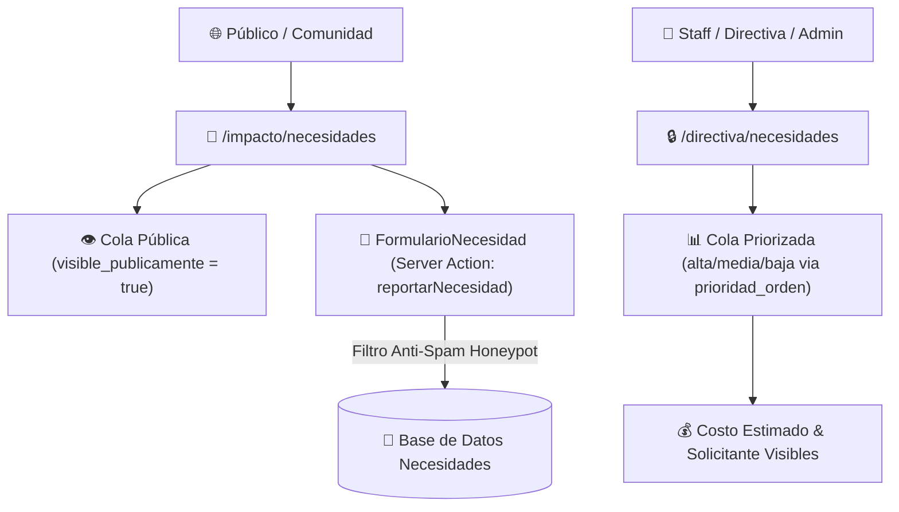

# 📋 Pipeline de Necesidades & Directiva — Forum Foundation

> [!list-check] Gestión de Carencias Comunitarias
> El módulo de Necesidades permite a la comunidad reportar carestías rurales y a la Junta Directiva priorizar la asignación de recursos y financiamiento.

---

## 🏗️ Arquitectura del Módulo de Necesidades

---

## 📌 Vistas e Interfaces

### 1. Página Pública (`/impacto/necesidades`)
- **Cola Pública**: Muestra casos con `visible_publicamente: true`. Despliega el avance del caso según su estado (`evaluacion`, `aprobada`, `en_ejecucion`, `completada`). No expone costos financieros ni la identidad del solicitante.
- **Formulario de Solicitud**: [FormularioNecesidad.tsx](file:///home/fabianc/Documentos/ForumPage/src/components/FormularioNecesidad.tsx). Permite a la comunidad reportar títulos, descripciones y comunidades afectadas.
- **Seguridad Server Action**: Los reportes se procesan mediante `reportarNecesidad` ([src/actions/reportar-necesidad.ts](file:///home/fabianc/Documentos/ForumPage/src/actions/reportar-necesidad.ts)) con `overrideAccess: true` y campo señuelo (*honeypot*) anti-spam.

### 2. Cola Priorizada de Directiva (`/directiva/necesidades`)
- **Dashboard Interno**: Diseñado para el rol `directiva`, `staff` y `admin`.
- **Agrupamiento por Prioridad**: Organiza los casos activos en 3 columnas/bloques (`Alta`, `Media`, `Baja`) ordenados numéricamente por `prioridad_orden`.
- **Casos Resueltos**: Se desglosan en una sección inferior independiente ("Completados") fuera de la cola de atención inmediata.
- **Transparencia Financiera**: Muestra el `costo_estimado` y el nombre del `solicitante` (restringidos por `FieldAccess` a visitantes públicos).
- **Gestión inline (2026-08-03)**: `staff`/`admin` ven, además de la tarjeta de lectura, los controles de [AccionesNecesidad.tsx](file:///home/fabianc/Documentos/ForumPage/src/components/staff/AccionesNecesidad.tsx) — cambiar `estado`, `prioridad`, `visible_publicamente` y vincular un `proyecto_resultante`, todo sin salir de esta página. La Server Action [actualizar-necesidad.ts](file:///home/fabianc/Documentos/ForumPage/src/actions/actualizar-necesidad.ts) exige el mismo rol que `Necesidades.access.update` (`esStaffOSuperior`) — **`directiva` sigue viendo solo la tarjeta de lectura, sin controles**: su rol es de rendición de cuentas, no de operación del pipeline. Antes de este cambio, mover un caso por el pipeline exigía `/admin` sin excepción.

### 3. Registro de Auditoría (`/directiva/auditoria`) — nuevo 2026-08-04
- **Gating**: solo `directiva`/`admin` — a diferencia de la cola de Necesidades, `staff` **no** entra (`Auditoria.access.read: esDirectivaOSuperior` lo excluye explícitamente). Antes de esto la colección se poblaba sola desde varios hooks pero nadie sin `/admin` podía leerla.
- **Contenido**: tabla paginada (30/página) con fecha, actor (`email`), acción, colección y documento; cada fila tiene un `
` nativo (sin JS de cliente) para ver `valor_anterior`/`valor_nuevo` en JSON.
- Link cruzado con `/directiva/necesidades` (única forma de descubrir cada página desde la otra — ninguna vive en la navegación de `/staff`, porque `/staff` entero está gateado a `staff`/`admin`, y esta página necesita `directiva`).

---

## 🔗 Nodos Relacionados
- [[🗺️ Home - Forum Foundation]]
- [[🔐 Matriz IAM y Permisos]]
- [[🗄️ Modelo de Datos y Colecciones]]
- [[🔄 Automatismos de Negocio]]
- [[🎨 Tokens de Diseño & Tipografía]]
