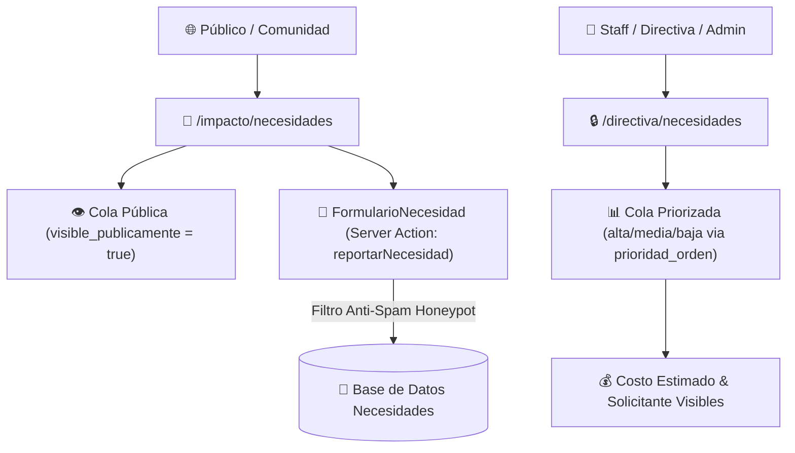

# 📋 Pipeline de Necesidades & Directiva — Forum Foundation

> [!list-check] Gestión de Carencias Comunitarias
> El módulo de Necesidades permite a la comunidad reportar carestías rurales y a la Junta Directiva priorizar la asignación de recursos y financiamiento.

---

## 🏗️ Arquitectura del Módulo de Necesidades

---

## 📌 Vistas e Interfaces

### 1. Página Pública (`/impacto/necesidades`)
- **Cola Pública**: Muestra casos con `visible_publicamente: true`. Despliega el avance del caso según su estado (`evaluacion`, `aprobada`, `en_ejecucion`, `completada`). No expone costos financieros ni la identidad del solicitante.
- **Formulario de Solicitud**: [FormularioNecesidad.tsx](file:///home/fabianc/Documentos/ForumPage/src/components/FormularioNecesidad.tsx). Permite a la comunidad reportar títulos, descripciones y comunidades afectadas.
- **Seguridad Server Action**: Los reportes se procesan mediante `reportarNecesidad` ([src/actions/reportar-necesidad.ts](file:///home/fabianc/Documentos/ForumPage/src/actions/reportar-necesidad.ts)) con `overrideAccess: true` y campo señuelo (*honeypot*) anti-spam.

### 2. Cola Priorizada de Directiva (`/directiva/necesidades`)
- **Dashboard Interno**: Diseñado para el rol `directiva`, `staff` y `admin`.
- **Agrupamiento por Prioridad**: Organiza los casos activos en 3 columnas/bloques (`Alta`, `Media`, `Baja`) ordenados numéricamente por `prioridad_orden`.
- **Casos Resueltos**: Se desglosan en una sección inferior independiente ("Completados") fuera de la cola de atención inmediata.
- **Transparencia Financiera**: Muestra el `costo_estimado` y el nombre del `solicitante` (restringidos por `FieldAccess` a visitantes públicos).

---

## 🔗 Nodos Relacionados
- [[🗺️ Home - Forum Foundation]]
- [[🔐 Matriz IAM y Permisos]]
- [[🗄️ Modelo de Datos y Colecciones]]
- [[🔄 Automatismos de Negocio]]
- [[🎨 Tokens de Diseño & Tipografía]]
