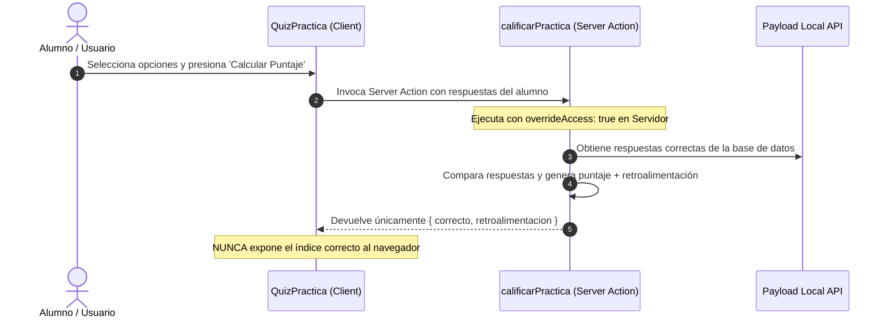

# 📚 Centro de Aprendizaje & Quizzes — Forum Foundation

> [!book] Valor Educativo Directo (`/aprende`)
> El Centro de Aprendizaje ofrece recursos educativos descargables, anuncios de tutorías y prácticas autocorregibles diseñadas para operar sin conexión o con bajo consumo de datos.

---

## 🧭 Secciones del Módulo

1. **Biblioteca (`/aprende/biblioteca`)**:
   - Filtros de búsqueda por materia, nivel educativo y tipo de recurso mediante Server Components y `FiltrosBiblioteca` sin recarga dura de página (`router.push`).
   - **Descarga Física**: Recursos de tipo `pdf_propio` incluyen el atributo `download` para guardar el archivo en el dispositivo para uso sin conexión.
   - **Videos de YouTube Diferidos**: Utiliza un reproductor estático personalizado que no carga los `iframe` de `youtube-nocookie.com` hasta que el estudiante hace clic explícito, ahorrando datos móviles.

2. **Tutorías (`/aprende/tutorias`)**:
   - Anuncios de sesiones de reforzamiento académico con filtro por materia y sede.

3. **Prácticas & Quizzes (`/aprende/practicas`)**:
   - Evaluaciones interactivas autocorregibles.

---

## 🔒 Arquitectura de Calificación Segura (Server Actions)

> [!security] Protección de Respuestas Correctas
> Los campos `respuesta_correcta` y `retroalimentacion` en [[🗄️ Modelo de Datos y Colecciones|Practicas]] tienen `FieldAccess` restringido a Staff/Admin. Ni siquiera la API pública de REST expone las respuestas.

---

## 🔗 Nodos Relacionados
- [[🗺️ Home - Forum Foundation]]
- [[🎨 Tokens de Diseño & Tipografía]]
- [[🔐 Matriz IAM y Permisos]]
- [[🗄️ Modelo de Datos y Colecciones]]
