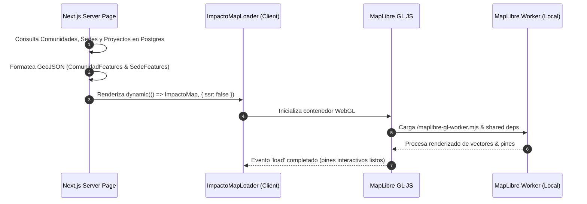

# 🗺️ Mapa de Impacto & MapLibre — Forum Foundation

> [!map] El Centro de Rendición de Cuentas (`/impacto`)
> El Mapa de Impacto combina datos geográficos reales de [[🗄️ Modelo de Datos y Colecciones|Comunidades y Sedes]] en Coclé Norte, conectándolos con sus proyectos activos, métricas y actividades.

---

## 🏗️ Arquitectura de Carga Asíncrona

---

## 🛠️ Mitigaciones Técnicas Realizadas

1. **Resolución del Web Worker de MapLibre en Webpack**:
   - `maplibre-gl` v6 utiliza `import.meta.url` para resolver su worker script, lo que causaba un error 404 en el bundling de Next.js.
   - **Solución**: El comando `postinstall` en `package.json` copia automáticamente `maplibre-gl-worker.mjs` y `maplibre-gl-shared.mjs` desde `node_modules` hacia `/public/`.
2. **Carga Estática Demarcada**:
   - El componente se carga mediante `next/dynamic({ ssr: false })` para aislar WebGL y los objetos `window` del lado del servidor.

---

## 🎛️ Componentes de Interfaz del Mapa

- **ImpactoTabs (Selector de vistas)**: Alternador superior entre "Mapa", "Resumen" y "Portal de equipo".
- **ImpactoOverview (Panel de Resumen)**: Panel estadístico implementado desde la vista `/impacto` que muestra métricas globales (estudiantes, proyectos), un becario destacado ("Scholar of the term") y dos tablas para monitorear proyectos en ejecución y destinos de estudio.
- **Depuración de Ubicaciones Falsas/Obsoletas**: Corrección de coordenadas de **El Caimito** a su posición real en Penonomé Norte (`8.6987, -80.2355` en la zona montañosa de Pajonal/Sofre) y eliminación completa del subtítulo/descripción obsoleto que hacía referencia a la antigua sede no existente.
- **Etiquetas de Texto Directas (Symbol Layers)**: Capa de renderizado de texto con halo blanco que muestra el nombre de cada comunidad y sede directamente sobre el mapa junto a su marcador visual.
- **Trayectoria de Becarios Internacionales**: capa `line` (`becarios-trayectorias-layer`, línea punteada origen→destino) reincorporada el 2026-08-06 a pedido del usuario — una iteración anterior la había quitado por considerarla "residual"; la visibilidad sigue ligada al mismo checkbox "Becarios Internacionales" que la capa de puntos.
- **Lista de Comunidades**: Navegación lateral que ejecuta `flyTo` al hacer clic en una comunidad.
- **Panel Lateral de Detalle de Comunidad**: Reemplaza el popup genérico con la ficha completa de la comunidad, sus proyectos en ejecución y el desglose de **becarios originarios de esa comunidad**.
- **Mini-Mapa Interactivo en la Portada (`/`)**: Componente `MapaPreviewHome` que renderiza un visor interactivo de MapLibre en miniatura enfocado en Coclé Norte (`[-80.3621, 8.6186]`), dibujando los puntos de las 9 comunidades, el badge `📍 Coclé Norte · 9 Comunidades` y el acceso directo `EXPLORAR MAPA COMPLETO →`, reemplazando cualquier contenedor estático.
- **Panel Flotante de Becario Internacional**: Tarjeta documental con foto de perfil/avatar, insignia del año de estudio, ruta visual (`📍 ORIGEN` ➔ `✈ DESTINO`), cita inspiradora estilizada y enlace localizado a la comunidad de origen.

---

## 🛠️ Gestión Directa del Mapa y Proyectos por el Staff (`/staff`)

Para cumplir la **Regla Rector** (*"gestionar o publicar en menos de 3 minutos desde un móvil"*), el staff gestiona el 100% de la plataforma sin ingresar a `/admin`:
- **Pestaña `BECARIOS`**: Registro y edición de expedientes, niveles, horas de labor social y verificaciones académicas.
- **Pestaña `PUBLICACIONES`**: Redacción y publicación de noticias, historias y actividades comunitarias.
- **Pestaña `COMUNIDADES (MAPA)`**: Lista navegable con coordenadas GPS, distritos y corregimientos con modales `+ Nueva Comunidad` y `✏ Editar Comunidad`.
- **Pestaña `PROYECTOS`**: Creación de proyectos de infraestructura y programas (`+ Nuevo Proyecto`), selector de estado (*Propuesto, Aprobado, En ejecución, Completado*), monto ($) y **control deslizante (slider 0-100%) para actualizar el % de avance en vivo** que alimenta el Mapa de Impacto (`/impacto`).
- **Autocompletado de Destinos Internacionales**: Selector con las coordenadas pre-cargadas de universidades frecuentes en el extranjero (*Bocconi, University of Florida, Navarra, Tec de Monterrey, Zamorano, EARTH*) para agilizar el registro de trayectorias.

---

## 🐛 Correcciones encontradas probando en local (2026-08-06)

- **Popups fuera del margen del mapa**: CSS Grid estira (`align-items: stretch`) por defecto los ítems de una fila a la altura del más alto. La lista de comunidades pierde su `max-h` desde `lg` para mostrar las ~35 sin scroll, y esa altura se contagiaba a la columna del mapa — el popup (anclado `top-4`/`bottom-4` a ese contenedor) llegaba a medir ~1770px en vez de ajustarse al mapa real. Fix: `items-start` en el grid.
- **"Países alcanzados" hardcodeado en "—"**: nunca se calculaba: ahora cuenta países distintos de `pais_estudio` entre los becarios internacionales.
- **Barra de avance "fantasma"**: al hacer clic en un punto del mapa (no desde la lista lateral), una comunidad sin proyectos mostraba la barra llena al 100%. MapLibre convierte las fuentes GeoJSON a vector tiles para dibujarlas, formato que no representa `null` en las propiedades — `avanceProm: null` llegaba como `undefined` al handler de clic sobre el canvas, y el guard `!== null` dejaba pasar ese `undefined`. Cambiado a `typeof === 'number'`.

## 🔗 Nodos Relacionados
- [[🗺️ Home - Forum Foundation]]
- [[🎨 Tokens de Diseño & Tipografía]]
- [[🗄️ Modelo de Datos y Colecciones]]
- [[🚀 Plan de Ejecución & Estado de Fases]]

