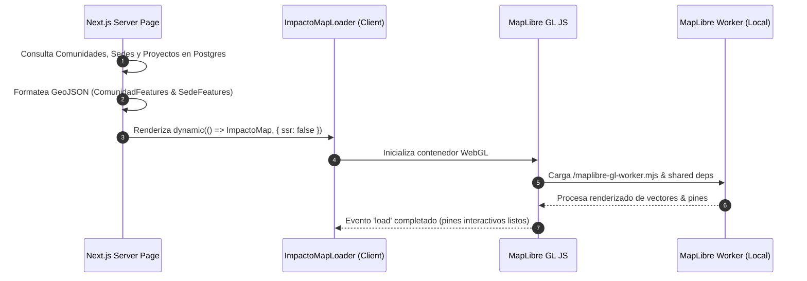

# 🗺️ Mapa de Impacto & MapLibre — Forum Foundation

> [!map] El Centro de Rendición de Cuentas (`/impacto`)
> El Mapa de Impacto combina datos geográficos reales de [[🗄️ Modelo de Datos y Colecciones|Comunidades y Sedes]] en Coclé Norte, conectándolos con sus proyectos activos, métricas y actividades.

---

## 🏗️ Arquitectura de Carga Asíncrona

---

## 🛠️ Mitigaciones Técnicas Realizadas

1. **Resolución del Web Worker de MapLibre en Webpack**:
   - `maplibre-gl` v6 utiliza `import.meta.url` para resolver su worker script, lo que causaba un error 404 en el bundling de Next.js.
   - **Solución**: El comando `postinstall` en `package.json` copia automáticamente `maplibre-gl-worker.mjs` y `maplibre-gl-shared.mjs` desde `node_modules` hacia `/public/`.
2. **Carga Estática Demarcada**:
   - El componente se carga mediante `next/dynamic({ ssr: false })` para aislar WebGL y los objetos `window` del lado del servidor.

---

## 🎛️ Componentes de Interfaz del Mapa

- **ImpactoTabs (Selector de vistas)**: Alternador superior entre "Mapa", "Resumen" y "Portal de equipo".
- **ImpactoOverview (Panel de Resumen)**: Panel estadístico implementado desde la vista `/impacto` que muestra métricas globales (estudiantes, proyectos), un becario destacado ("Scholar of the term") y dos tablas para monitorear proyectos en ejecución y destinos de estudio.
- **Sidebar de Métricas Reales**: En el mapa, muestra 6 contadores (Comunidades, Sedes, Proyectos Activos, Obras Completadas, Becarios Activos, Países alcanzados).
- **Lista de Comunidades**: Navegación lateral que ejecuta `flyTo` al hacer clic en una comunidad.
- **Panel Lateral de Detalle**: Reemplaza el popup genérico con la ficha completa de la comunidad y sus proyectos en ejecución.

---

## 🔗 Nodos Relacionados
- [[🗺️ Home - Forum Foundation]]
- [[🎨 Tokens de Diseño & Tipografía]]
- [[🗄️ Modelo de Datos y Colecciones]]
- [[🚀 Plan de Ejecución & Estado de Fases]]
