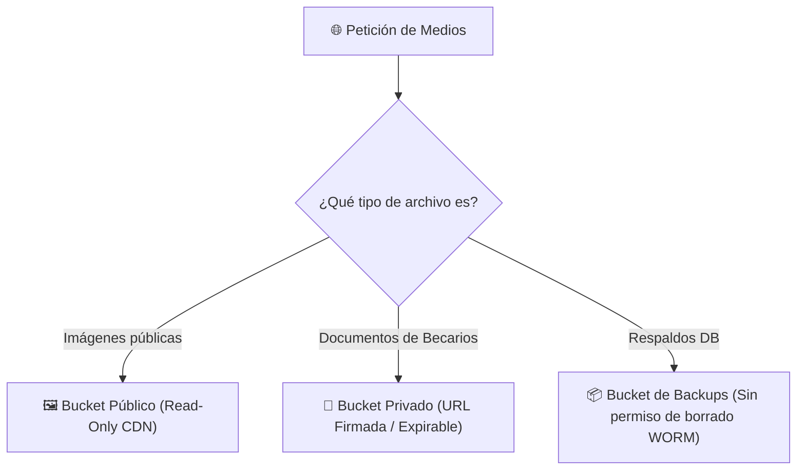

# 🛡️ Ciberseguridad & No-Negociables — Forum Foundation

> [!security] Principios Inquebrantables de Seguridad
> Reglas y controles extraídos del documento `05-ciberseguridad.md` y las políticas del proyecto.

---

## ⛔ Reglas No-Negociables

1. **Protección de Menores de Edad**:
   - La colección `Media` implementa validación cruzada: `contiene_menores: true` requiere obligatoriamente `consentimiento_verificado: true`.
2. **Privacidad Absoluta de Suspensiones**:
   - El estado `suspendido` de un becario nunca se expone al público ni de forma agregada. Los campos `estado`, `motivo_suspension`, `fecha_suspension` y `fecha_reactivacion` en [[🗄️ Modelo de Datos y Colecciones|Becarios]] poseen `FieldAccess` restringido exclusivamente al propio becario y al staff.
3. **Privacidad de Solicitantes de Carencias**:
   - El campo `solicitante` en [[🗄️ Modelo de Datos y Colecciones|Necesidades]] tiene `FieldAccess` `esStaffDirectivaOAdminFieldAccess`. Se oculta en consultas públicas para proteger la privacidad del comunero que reporta una necesidad.
4. **Protección Anti-Spam en Formularios Públicos**:
   - El formulario de reporte de necesidades ([FormularioNecesidad.tsx](file:///home/fabianc/Documentos/ForumPage/src/components/FormularioNecesidad.tsx)) incluye un campo señuelo oculto (*honeypot*). Si un bot completa dicho campo, el Server Action simula éxito sin escribir en la base de datos.
5. **Auditoría Activa e Inmutable en 7 Eventos Clave**:
   - La colección `Auditoria` registra automáticamente 7 eventos de negocio (`suspension_automatica`, `reactivacion_automatica`, `verificacion_registro_academico`, `verificacion_recuperacion`, `aprobacion_horas`/`rechazo_horas`, `cambio_estado_desembolso` y `cambio_de_rol`). La escritura manual está totalmente bloqueada.
6. **Privacidad de Documentación Socioeconómica & Evaluaciones**:
   - Los campos `nota_interna_evaluacion` en [[🗄️ Modelo de Datos y Colecciones|RegistrosAcademicos]] y `documentacion_socioeconomica` en [[🗄️ Modelo de Datos y Colecciones|Becarios]] son de lectura restringida a Staff/Admin.
7. **Duración Diferenciada de JWT / Sesiones**:
   - Sesiones del personal (`admin`, `staff`, `directiva`) duran máximo **2 horas**. Sesiones de becarios duran **30 días**.
8. **Protección contra Salteo de 2FA en Reset de Contraseña**:
   - El endpoint `/api/users/reset-password` exige la verificación de 2FA TOTP si la cuenta lo tenía habilitado.
9. **Procedimiento de Baja Inmediata (Bloqueo en Login)**:
   - Las cuentas se desmarcan con `activo = false`. El hook `beforeLogin` de Payload rechaza inmediatamente el inicio de sesión.
10. **Autenticación de Dos Factores (2FA TOTP Opcional)**:
    - Mecanismo TOTP (RFC 6238) completo con secreto cifrado e inalcanzable por API (`{ create: () => false, read: () => false, update: () => false }`). 2FA es **opcional para todos los roles**.
11. **Alta Segura por Invitación**:
    - Contraseña provisional invalidada con string aleatorio de 32 bytes y `enlace_invitacion` de 1 solo uso que vence en 1 hora.
12. **Desactivación de GraphQL**:
    - GraphQL está totalmente desactivado en `payload.config.ts`.
13. **Sanitización de Contenido Lexical**:
    - Serializado vía `@payloadcms/richtext-lexical/react`. Prohibido `dangerouslySetInnerHTML`.
14. **Inmutabilidad de Desembolsos**:
    - Permiso `delete` en [[🗄️ Modelo de Datos y Colecciones|Desembolsos]] retorna `() => false` para todos los roles.
15. **Documentos de expediente nunca en el bucket público** (remediación 2026-08-01/03, **migración confirmada en dev, producción pendiente del droplet**):
    - `Becarios.documentacion_socioeconomica`, `RegistrosAcademicos.documento`, `HorasLaborSocial.evidencia` y `Recuperaciones.evidencia` migraron de `Media` (pública) a [[🗄️ Modelo de Datos y Colecciones|DocumentosPrivados]] (solo-staff en las cuatro operaciones). Ver [[🚀 Plan de Ejecución & Estado de Fases]] para el estado exacto — las 17 migraciones están aplicadas contra el Postgres de dev y `pnpm purgar:media-privada` da 0 a borrar hoy; solo falta correr contra producción cuando exista droplet.
16. **Foto de becario condicionada al consentimiento** (2026-08-04): `Becarios.foto` pasó de `Media` (siempre pública) a [[🗄️ Modelo de Datos y Colecciones|FotosBecarios]], con `access.read` condicional a un campo `publica` que un hook sincroniza con `mostrar_en_mapa` en cada save. Antes, apagar el consentimiento sacaba al becario de `/api/becarios` pero su foto seguía sirviéndose para siempre — resuelto sin depender de buckets S3.

---

## 🪣 Aislamiento de Almacenamiento (Buckets)

> [!warning] Estado real (no aspiracional)
> Solo el nivel de **colección** está hecho (`Media` pública vs. `DocumentosPrivados` solo-staff vs. `FotosBecarios` condicional). A nivel de **almacenamiento** no hay todavía adaptador S3 — los archivos siguen en disco local y el control de acceso lo aplica Payload en la ruta del archivo (`access.read` evaluado en cada request), no 3 buckets físicos separados. Esto alcanza para el caso de `Becarios.foto` (2026-08-04): pública solo si `mostrar_en_mapa` sigue activo. Al mover a S3 hay que separar los buckets de verdad y firmar URLs — pero eso es un cambio de *dónde* vive el archivo, no un rediseño del control de acceso, que ya es correcto hoy.

---

## 🔗 Nodos Relacionados
- [[🗺️ Home - Forum Foundation]]
- [[🔐 Matriz IAM y Permisos]]
- [[🗄️ Modelo de Datos y Colecciones]]
- [[📋 Pipeline de Necesidades & Directiva]]
- [[⚙️ Runbook Técnico & Entornos]]
