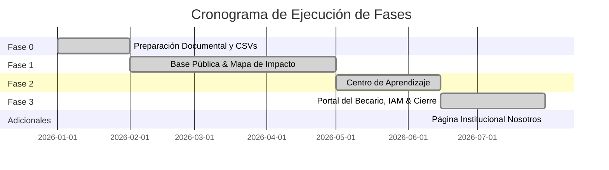

# 🚀 Plan de Ejecución & Estado de Fases — Forum Foundation

> [!flag] Estado General del Proyecto
> Seguimiento vivo del progreso de desarrollo. Fuente original: [docs/plan.md](file:///home/fabianc/Documentos/ForumPage/docs/plan.md).

---

## 📊 Progreso por Fases

---

## 📋 Resumen Detallado de Fases

### Fase 0 — Preparación (100% Completada)
- [x] Borrador bilingüe de formulario de consentimiento.
- [x] CSVs de plantillas para comunidades, sedes, programas y becarios.
- [x] Inventario de 70 artículos extraídos de WordPress y script de migración.

### Fase 1 — Base Pública (100% Completada)
- [x] Payload CMS 3 + PostgreSQL configurados con i18n (`es`/`en`).
- [x] Colecciones base (`Comunidades`, `Sedes`, `Proyectos`, `Actividades`).
- [x] Frontend localizado con Next.js 16 App Router.
- [x] [[🗺️ Mapa de Impacto & MapLibre|Mapa de Impacto]] en `/impacto` con MapLibre GL JS y fix de workers localizados.
- [x] Docker Compose (app, db, Caddy) + GitHub Actions CI (con presupuesto de 500 KB).

### Fase 2 — Centro de Aprendizaje (100% Completada)
- [x] [[📚 Centro de Aprendizaje & Quizzes|Biblioteca de Recursos]] con descarga física de PDFs.
- [x] Videos de YouTube diferidos con `youtube-nocookie`.
- [x] Quizzes interactivos calificados mediante Server Actions (`calificarPractica`).

### Fase 3 — Portal del Becario, Necesidades & Cierre (100% COMPLETADA — Pasos A al R)
- [x] [[🗄️ Modelo de Datos y Colecciones|Colecciones Creadas]]: `Becarios`, `RegistrosAcademicos`, `Recuperaciones`, `HorasLaborSocial`, `Desembolsos`, `Necesidades`.
- [x] [[🔄 Automatismos de Negocio|Automatismos Implementados]]: Suspensión por reprobación, retención/liberación de pagos, reactivación por recuperaciones.
- [x] [[🛡️ Ciberseguridad & No-Negociables|Campos Privados de Evaluación]]: `nota_interna_evaluacion` y `documentacion_socioeconomica` restringidos a Staff/Admin.
- [x] [[🔐 Matriz IAM y Permisos|Paso G — Bloqueo de Cuentas Inactivas]]: `beforeLogin` rechaza acceso si `activo = false`; `afterLogin` registra `ultimo_acceso`.
- [x] [[🔐 Matriz IAM y Permisos|Paso H — 2FA TOTP Opcional]]: Endpoints `/2fa/generar`, `/2fa/confirmar` y `/2fa/desactivar`. 2FA opcional para todos los roles.
- [x] [[🔐 Matriz IAM y Permisos|Paso I — Alta por Invitación]]: Hook `generarInvitacionAlCrear` invalida contraseña provisional y genera `enlace_invitacion`.
- [x] [[🔐 Matriz IAM y Permisos|Paso J — Reset de Contraseña Seguro]]: Cobertura 2FA en `/api/users/reset-password`, pantallas `/cuenta/recuperar` y `/cuenta/restablecer`.
- [x] [[🔐 Matriz IAM y Permisos|Paso K — Duración de Sesión por Rol]]: 2h staff/admin vs 30d becarios mediante `jwtSign` dinámico.
- [x] [[👨‍🎓 Portal del Becario & Sesiones|Paso L — Panel Principal de Becarios]]: Interfaz `/portal` con barra de progreso de horas de labor social y aviso de suspensión.
- [x] [[👨‍🎓 Portal del Becario & Sesiones|Paso M — Historial de Desembolsos]]: Lista cronológica en `/portal` con estados visualmente codificados por color.
- [x] [[👨‍🎓 Portal del Becario & Sesiones|Paso N — Experiencia de Suspensión & Reactivación]]: Cálculo en vivo con `materiasPendientes()`, timestamp `fecha_reactivacion` y banner de regreso.
- [x] [[📋 Pipeline de Necesidades & Directiva|Paso O — Colección Necesidades]]: Colección 20 de Payload con ordenamiento numérico `prioridad_orden` y privacidad de solicitante.
- [x] [[📋 Pipeline de Necesidades & Directiva|Paso P — Página Pública de Necesidades]]: Cola pública y formulario con filtro anti-spam honeypot en `/impacto/necesidades`.
- [x] [[📋 Pipeline de Necesidades & Directiva|Paso Q — Dashboard de Directiva]]: Cola priorizada agrupada por prioridad (`alta`, `media`, `baja`) en `/directiva/necesidades`.
- [x] [[🔄 Automatismos de Negocio|Paso R — Auditoría Activa & Vista de Directiva]]: Helper `registrarAuditoria` para 7 eventos de negocio y verificación HTTP 200/403 en las 21 colecciones + 2 globales. **¡FASE 3 CERRADA!**

### Adicionales Institucionales (100% Completados)
- [x] [[🏛️ Página Institucional Nosotros|Página /nosotros & Equipo]]: Integración de la vista `/nosotros` con el global `Nosotros` (misión e historia en RichText Lexical) y la colección `Equipo` (21ª colección, miembros del equipo y tarjeta destacada del fundador). Sembrado de datos reales vía `pnpm seed:nosotros`.
- [x] **Herramientas de Operación del Staff en `/staff`**:
  - Modal `+ Registrar Becario` y `✏ Edit Profil` con selector de nivel académico.
  - Pestaña `COMUNIDADES (MAPA)` con modales `+ Nueva Comunidad` y `✏ Editar Comunidad` para administración de coordenadas GPS.
  - Selector de autocompletado de **Destinos Internacionales Frecuentes** (*Bocconi, University of Florida, Navarra, Tec, Zamorano, EARTH*).
  - Tarjeta documental del becario internacional en el mapa con foto, cita inspiradora, insignias de trayectoria e i18n (`es`/`en`).
  - Integración de becarios originarios en la Ficha de la Comunidad (`/impacto/comunidades/[slug]`).

---

## 🔗 Nodos Relacionados
- [[🗺️ Home - Forum Foundation]]
- [[📋 Visión y Documento de Proyecto]]
- [[🏗️ Especificación Técnica (Spec)]]
- [[🗄️ Modelo de Datos y Colecciones]]
- [[🏛️ Página Institucional Nosotros]]
- [[📋 Pipeline de Necesidades & Directiva]]
- [[👨‍🎓 Portal del Becario & Sesiones]]
