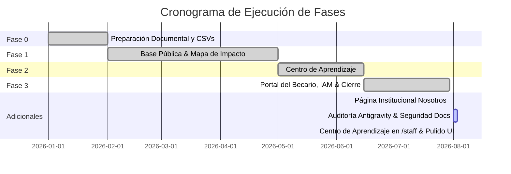

# 🚀 Plan de Ejecución & Estado de Fases — Forum Foundation

> [!flag] Estado General del Proyecto
> Seguimiento vivo del progreso de desarrollo. Fuente original: [docs/plan.md](file:///home/fabianc/Documentos/ForumPage/docs/plan.md).
> **Última actualización:** 2026-08-03 — Centro de Aprendizaje en `/staff` (CRUD de Recursos/Tutorías/Prácticas sin pasar por `/admin`, panel lateral) + pulido de UI pública (filtros de Prácticas, Ver/Descargar en Biblioteca, banderas en el idioma).

---

## 📊 Progreso por Fases

---

## 📋 Resumen Detallado de Fases

### Fase 0 — Preparación (100% Completada)
- [x] Borrador bilingüe de formulario de consentimiento.
- [x] CSVs de plantillas para comunidades, sedes, programas y becarios.
- [x] Inventario de 70 artículos extraídos de WordPress y script de migración.

### Fase 1 — Base Pública (100% Completada)
- [x] Payload CMS 3 + PostgreSQL configurados con i18n (`es`/`en`).
- [x] Colecciones base (`Comunidades`, `Sedes`, `Proyectos`, `Actividades`).
- [x] Frontend localizado con Next.js 16 App Router.
- [x] [[🗺️ Mapa de Impacto & MapLibre|Mapa de Impacto]] en `/impacto` con MapLibre GL JS y fix de workers localizados.
- [x] Docker Compose (app, db, Caddy) + GitHub Actions CI (con presupuesto de 500 KB).

### Fase 2 — Centro de Aprendizaje (100% Completada)
- [x] [[📚 Centro de Aprendizaje & Quizzes|Biblioteca de Recursos]] con descarga física de PDFs.
- [x] Videos de YouTube diferidos con `youtube-nocookie`.
- [x] Quizzes interactivos calificados mediante Server Actions (`calificarPractica`).

### Fase 3 — Portal del Becario, Necesidades & Cierre (100% COMPLETADA — Pasos A al R)
- [x] [[🗄️ Modelo de Datos y Colecciones|Colecciones Creadas]]: `Becarios`, `RegistrosAcademicos`, `Recuperaciones`, `HorasLaborSocial`, `Desembolsos`, `Necesidades`.
- [x] [[🔄 Automatismos de Negocio|Automatismos Implementados]]: Suspensión por reprobación, retención/liberación de pagos, reactivación por recuperaciones.
- [x] [[🛡️ Ciberseguridad & No-Negociables|Campos Privados de Evaluación]]: `nota_interna_evaluacion` y `documentacion_socioeconomica` restringidos a Staff/Admin.
- [x] [[🔐 Matriz IAM y Permisos|Paso G — Bloqueo de Cuentas Inactivas]]: `beforeLogin` rechaza acceso si `activo = false`; `afterLogin` registra `ultimo_acceso`.
- [x] [[🔐 Matriz IAM y Permisos|Paso H — 2FA TOTP Opcional]]: Endpoints `/2fa/generar`, `/2fa/confirmar` y `/2fa/desactivar`. 2FA opcional para todos los roles.
- [x] [[🔐 Matriz IAM y Permisos|Paso I — Alta por Invitación]]: Hook `generarInvitacionAlCrear` invalida contraseña provisional y genera `enlace_invitacion`.
- [x] [[🔐 Matriz IAM y Permisos|Paso J — Reset de Contraseña Seguro]]: Cobertura 2FA en `/api/users/reset-password`, pantallas `/cuenta/recuperar` y `/cuenta/restablecer`.
- [x] [[🔐 Matriz IAM y Permisos|Paso K — Duración de Sesión por Rol]]: 2h staff/admin vs 30d becarios mediante `jwtSign` dinámico.
- [x] [[👨‍🎓 Portal del Becario & Sesiones|Paso L — Panel Principal de Becarios]]: Interfaz `/portal` con barra de progreso de horas de labor social y aviso de suspensión.
- [x] [[👨‍🎓 Portal del Becario & Sesiones|Paso M — Historial de Desembolsos]]: Lista cronológica en `/portal` con estados visualmente codificados por color.
- [x] [[👨‍🎓 Portal del Becario & Sesiones|Paso N — Experiencia de Suspensión & Reactivación]]: Cálculo en vivo con `materiasPendientes()`, timestamp `fecha_reactivacion` y banner de regreso.
- [x] [[📋 Pipeline de Necesidades & Directiva|Paso O — Colección Necesidades]]: Colección 20 de Payload con ordenamiento numérico `prioridad_orden` y privacidad de solicitante.
- [x] [[📋 Pipeline de Necesidades & Directiva|Paso P — Página Pública de Necesidades]]: Cola pública y formulario con filtro anti-spam honeypot en `/impacto/necesidades`.
- [x] [[📋 Pipeline de Necesidades & Directiva|Paso Q — Dashboard de Directiva]]: Cola priorizada agrupada por prioridad (`alta`, `media`, `baja`) en `/directiva/necesidades`.
- [x] [[🔄 Automatismos de Negocio|Paso R — Auditoría Activa & Vista de Directiva]]: Helper `registrarAuditoria` para 7 eventos de negocio y verificación HTTP 200/403 en las 21 colecciones + 2 globales. **¡FASE 3 CERRADA!**

### Adicionales Institucionales (100% Completados)
- [x] [[🏛️ Página Institucional Nosotros|Página /nosotros & Equipo]]: Integración de la vista `/nosotros` con el global `Nosotros` (misión e historia en RichText Lexical) y la colección `Equipo` (21ª colección, miembros del equipo y tarjeta destacada del fundador). Sembrado de datos reales vía `pnpm seed:nosotros`.
- [x] **Herramientas de Operación Integral del Staff en `/staff` (100% Sin pasar por `/admin`)**:
  - Pestaña `BECARIOS`: Modal `+ Registrar Becario` y `✏ Edit Profil` con selector de nivel académico y horas de labor social.
  - Pestaña `PUBLICACIONES`: Redacción de artículos y actividades comunitarias.
  - Pestaña `COMUNIDADES (MAPA)`: Modales `+ Nueva Comunidad` y `✏ Editar Comunidad` para administración de coordenadas GPS.
  - Pestaña `PROYECTOS`: Modal `+ Nuevo Proyecto` y `✏ Editar / Avance` con slider (0-100%) para actualización en vivo del porcentaje de avance en el Mapa de Impacto.
  - Pestaña `NOSOTROS / EQUIPO`: Modales `✏ Editar Misión e Historia` (global `/nosotros`) y `+ Agregar Miembro` / `✏ Editar Miembro` (colección `equipo` con tarjeta destacada para el fundador).
  - Pestaña `CENTRO DE APRENDIZAJE` (2026-08-03): CRUD completo de `Recursos`, `Tutorías` y `Prácticas` vía modales — ver sección dedicada más abajo.
  - Navegación pasó de barra horizontal a panel lateral en desktop (md+) al no entrar ya 6 pestañas en el ancho de pantalla; en mobile sigue horizontal con scroll.
  - Selector de autocompletado de **Destinos Internacionales Frecuentes** (*Bocconi, University of Florida, Navarra, Tec, Zamorano, EARTH*).
  - Tarjeta documental del becario internacional en el mapa con foto, cita inspiradora, insignias de trayectoria e i18n (`es`/`en`).
  - Integración de becarios originarios en la Ficha de la Comunidad (`/impacto/comunidades/[slug]`).

### Auditoría Externa & Remediación de Seguridad (2026-08-01/03 — Parcialmente Pendiente)
- [x] **Auditoría del trabajo de Antigravity** (21 commits directos a `main` — el usuario cambió de programador principal por límite de uso en Claude). Alcance: CRUD completo de staff para Comunidades/Proyectos/Equipo/Nosotros, 16 corregimientos de Penonomé cargados en `Comunidades`, mapa base real (CartoDB/OSM), mini-mapa en el Home, ficha de comunidad con becarios originarios, tarjeta "Becario Destacado" en `/impacto`.
  **Encontrado y corregido:** fuga real de consentimiento — dos páginas públicas (`/impacto/comunidades/[slug]` y `/impacto`) leían becarios con `overrideAccess: true` sin reponer el filtro `mostrar_en_mapa` que la colección aplicaría normalmente, exponiendo (con datos reales) a becarios que hubieran revocado su consentimiento.
  **Encontrado, no corregido:** los "Destinos Internacionales Frecuentes" (Bocconi, University of Florida, etc.) quedaron hardcodeados en dos formularios — viola "nada hardcodeado" en espíritu, no es urgencia de seguridad.
  **Meta-hallazgo:** `docs/plan.md` no se tocó en ninguno de los 21 commits — regla agregada a `.agents/AGENTS.md` para que no se repita.
- [ ] **Remediación de privacidad de documentos — código listo, migración SIN correr en producción.** `Becarios.documentacion_socioeconomica`, `RegistrosAcademicos.documento`, `HorasLaborSocial.evidencia` y `Recuperaciones.evidencia` vivían en `Media` (`read: () => true`, pública) — cualquiera con la URL podía descargar documentación socioeconómica o evidencia de labor social que puede contener menores. Nueva colección `DocumentosPrivados` (solo-staff en las cuatro operaciones — ni siquiera directiva lee, único caso así en todo el sistema, porque ninguna vista del becario ni de directiva renderiza estos archivos).
  Migración en dos mitades: la migración SQL copia las filas de `media` a `documentos_privados` preservando el id (mantiene las FK válidas sin remapear) y reescribe la `url`; `pnpm purgar:media-privada` mueve el archivo físico y borra el original público con `payload.delete`.
  **Postgres estuvo caído durante todo este trabajo — la migración nunca se ejecutó y el script de purga nunca corrió.** Pendiente antes de dar esto por cerrado: `pnpm payload migrate`, luego `pnpm purgar:media-privada` (dry-run, revisar salida) y `pnpm purgar:media-privada --purge`, y confirmar con un GET sin sesión contra `/api/documentos-privados` (no la interfaz) que responde 403/404.

### Centro de Aprendizaje en `/staff` & Pulido de UI Pública (2026-08-03 — Completo)
- [x] **Nueva pestaña Centro de Aprendizaje.** El staff no tenía forma de publicar `Recursos`/`Tutorías`/`Prácticas` sin pasar por `/admin` — justo lo que `/staff` existe para evitar. CRUD completo vía modales para las tres colecciones; `Prácticas` incluye armado de preguntas/opciones en el mismo panel (sin salir a `/admin`), con validación de mínimo 2 opciones completas por pregunta y un índice de respuesta correcta válido. `Recursos.archivo`/`Practicas.archivo` suben a `media` a propósito (material público de la Biblioteca, no expediente privado).
- [x] **Bug real encontrado probando con 20 preguntas reales (a pedido del usuario, no hipotético):** el modal centraba verticalmente con `items-center` — con contenido más alto que la ventana eso atasca el scroll del navegador (bug conocido de Chromium con flexbox centrado + overflow), el título quedaba fuera del viewport sin forma de volver arriba. Corregido a `items-start` en los tres modales nuevos.
- [x] **Las 3 modalidades de Práctica verificadas de punta a punta, no solo compiladas:** autocorregido (20 preguntas reales, `respuesta_correcta`/`retroalimentacion` confirmadas ausentes de `/api/practicas` sin sesión), con progreso (calificado + recarga confirmando "Completado antes: X/Y" desde `localStorage`), descargable (archivo real subido vía `DataTransfer`, descarga confirmada con `curl`). Datos de prueba borrados después en los tres casos.
- [x] **Filtros en `/aprende/practicas`** (modalidad/nivel/materia + paginación), reutilizando [[📚 Centro de Aprendizaje & Quizzes|`FiltrosBiblioteca`]] tal cual, sin duplicar el componente.
- [x] **"Ver" y "Descargar" separados para PDF propio en Biblioteca** — antes un solo botón forzaba descarga siempre; ahora "Ver" abre en pestaña nueva con el visor nativo del navegador y "Descargar" sigue forzando el guardado para uso sin conexión.
- [x] **Selector de idioma con banderas** 🇵🇦/🇺🇸 en vez de texto plano "EN"/"ES" — se veía pegado al logo en mobile, sin contenedor propio.
- [x] **Botón "Portal de equipo" removido de `/impacto`** — Antigravity lo había agregado enlazando a `/portal` (autenticado); un visitante anónimo solo chocaba con un login.
- [x] **Niveles/materias faltantes agregados vía script contra Payload** (Universidad; Química, Física, Biología, Historia, Geografía) — nunca hardcodeados en código.

---

## 🔗 Nodos Relacionados
- [[🗺️ Home - Forum Foundation]]
- [[📋 Visión y Documento de Proyecto]]
- [[🏗️ Especificación Técnica (Spec)]]
- [[🗄️ Modelo de Datos y Colecciones]]
- [[🏛️ Página Institucional Nosotros]]
- [[📋 Pipeline de Necesidades & Directiva]]
- [[👨‍🎓 Portal del Becario & Sesiones]]
- [[🛡️ Ciberseguridad & No-Negociables]]
